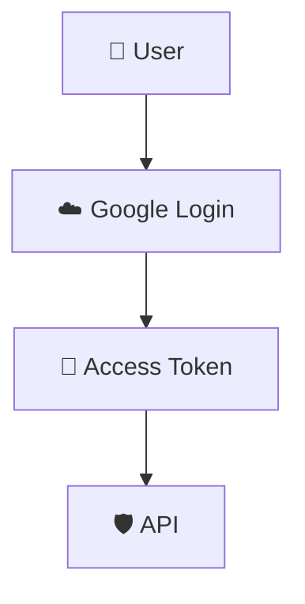
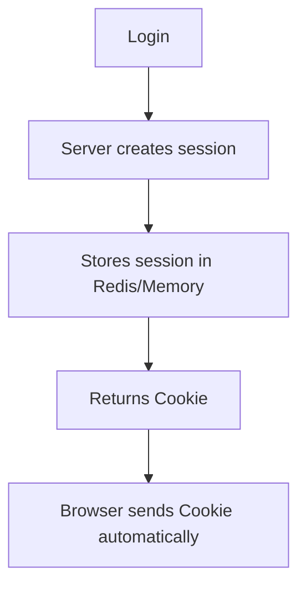
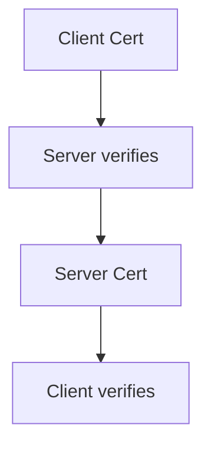
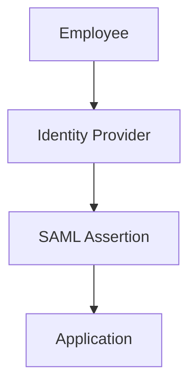
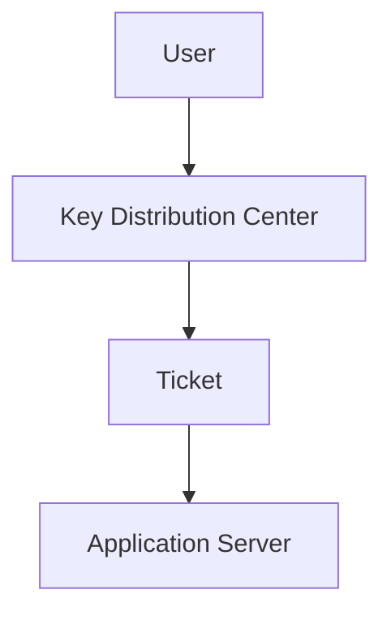
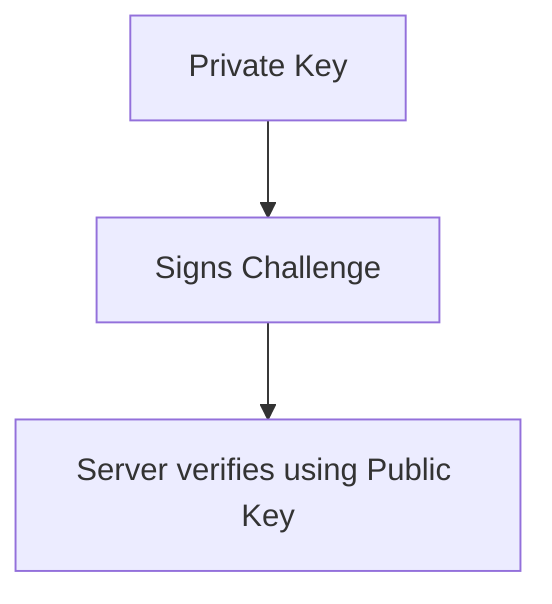

# 🔑 Authentication Schemes: An Introduction

If you're referring to authentication schemes used in APIs, applications, and distributed systems, API key-based authentication is just one of many options.

Here's a comparison of the most common authentication schemes.

| Authentication Scheme | Identity Verified By | Common Use Cases |
| :--- | :--- | :--- |
| API Key | Secret key | Public APIs, internal services |
| Basic Authentication | Username + Password | Legacy systems |
| Bearer Token | Access Token (usually JWT or opaque token) | REST APIs, SPAs |
| OAuth 2.0 | Authorization Server issues tokens | Third-party integrations |
| OpenID Connect (OIDC) | Identity Token (JWT) | User login (Google, Microsoft) |
| JWT Authentication | Signed JSON Web Token | Microservices, stateless APIs |
| Session/Cookie Authentication | Session ID in Cookie | Traditional web applications |
| Mutual TLS (mTLS) | Client Certificate | Internal services, banking |
| HMAC Authentication | Signature generated using shared secret | AWS APIs, webhook verification |
| SAML | XML Assertions | Enterprise SSO |
| Kerberos | Ticket-based authentication | Active Directory environments |
| SSH Key Authentication | Public/Private Key Pair | SSH login, Git |
| Passkeys/WebAuthn | Public-key cryptography | Passwordless login |

---

## 🔑 1. API Key Authentication

### How it works

The client sends a secret key with every request.

```
GET /users
Authorization: ApiKey abc123xyz
```

or

```
x-api-key: abc123xyz
```

**Advantages**

* Very simple
* Easy to implement
* Good for server-to-server communication
* Low overhead

**Disadvantages**

* Doesn't identify users
* Hard to revoke selectively
* Usually long-lived
* Can leak if exposed

**Used for:**

* Weather APIs
* Internal APIs
* CI/CD systems

---

## 🔐 2. Basic Authentication

Client sends

```
Base64(username:password)
```

Example

```
Authorization: Basic dXNlcjpwYXNz
```

This is not encrypted—it's only Base64 encoded, so it should always be used over HTTPS.

**Pros**

* Extremely simple
* Supported everywhere

**Cons**

* Sends credentials every request
* Password exposure risk
* No expiration

Mostly used by legacy systems.

---

## 🎫 3. Bearer Token Authentication

Instead of a password, the client sends a token.

```
Authorization: Bearer eyJhbGc...
```

The server validates the token.

Very common in:

* REST APIs
* Mobile apps
* Single Page Applications (React/Angular/Vue)

---

## 🪪 4. JWT Authentication

JWT (JSON Web Token) is a specific kind of bearer token.

Example

```
Header.Payload.Signature
```

Payload

```json
{
  "sub": "123",
  "role": "admin",
  "exp": 1720000000
}
```

Server verifies the signature.

**Advantages**

* Stateless
* Fast verification
* Easy to scale

**Disadvantages**

* Difficult to revoke before expiry
* Tokens can become large
* Sensitive claims should not be trusted unless verified

---

## 🔄 5. OAuth 2.0

OAuth is an authorization framework, not an authentication protocol.



**Common flows**

* Authorization Code
* Client Credentials
* Device Code
* Refresh Token

**Used by**

* Google APIs
* GitHub
* Microsoft Graph
* Slack

---

## 🆔 6. OpenID Connect (OIDC)

Built on top of OAuth2.

Adds an ID Token that tells applications who the user is.

**Common examples**

* Login with Google
* Login with Microsoft
* Login with Okta

**Returns**

* Access Token
* Refresh Token
* ID Token

---

## 🍪 7. Session Authentication

Traditional websites.

**Flow**



Example

```
Cookie:
SESSIONID=abc123
```

**Advantages**

* Easy logout
* Easy revocation
* Mature ecosystem

**Disadvantages**

* Requires server-side session storage
* Session replication or centralized storage needed in distributed systems

---

## 📜 8. Mutual TLS (mTLS)

Both client and server present certificates.



**Used in**

* Banking
* Kubernetes control plane
* Service meshes (e.g., Istio, Linkerd)

**Advantages**

* Very strong authentication
* Resistant to credential theft

**Disadvantages**

* Certificate lifecycle management is complex

---

## ✍️ 9. HMAC Authentication

Instead of sending a secret, the client signs the request.

Example

```
Signature =
HMAC(secret, method + path + body + timestamp)
```

Header

```
Authorization:
Signature abcxyz...
```

Server recomputes the signature.

**Used by**

* AWS Signature Version 4
* Many webhook providers

**Advantages**

* Secret never transmitted
* Detects tampering
* Helps prevent replay attacks when timestamps/nonces are included

---

## 🏢 10. SAML Authentication

Enterprise Single Sign-On.



**Common in**

* Large enterprises
* Older corporate applications

---

## 🎟️ 11. Kerberos

Uses tickets instead of passwords.



**Used in**

* Windows domains
* Active Directory
* Enterprise networks

---

## 🐚 12. SSH Key Authentication

Instead of passwords:



**Used for**

* SSH
* Git
* Infrastructure automation

---

## 👆 13. Passkeys / WebAuthn

Modern passwordless authentication.

**Uses:**

* Public-key cryptography
* Device-bound credentials
* Biometrics or PIN for local user verification

**Common examples**

* Face ID
* Windows Hello
* Android passkeys

**Advantages**

* Phishing-resistant
* No passwords stored by the service
* Better user experience

---

## ⚖️ Production Tradeoffs

| Scheme | Stateful | Scalable | Revocable | Human Login | Machine-to-Machine |
| :--- | :--- | :--- | :--- | :--- | :--- |
| API Key | No | Excellent | Limited | No | Excellent |
| Basic Auth | No | Good | Poor | Yes | Limited |
| JWT | No | Excellent | Difficult | Yes | Yes |
| Session | Yes | Good (with shared session store) | Excellent | Excellent | No |
| OAuth2 | Depends | Excellent | Excellent | Yes | Yes |
| OIDC | Depends | Excellent | Excellent | Excellent | No |
| mTLS | No | Excellent | Certificate-based | Rare | Excellent |
| HMAC | No | Excellent | Good | No | Excellent |
| SAML | Depends | Good | Good | Enterprise | Rare |
| Kerberos | Yes | Enterprise | Good | Enterprise | Enterprise |
| SSH Keys | No | Excellent | Good | Admin access | Excellent |
| Passkeys | No | Excellent | Good | Excellent | No |

---

## 🚨 Common Failure Scenarios and Debugging

| Scheme | Common Issue | Symptoms | Debugging |
| :--- | :--- | :--- | :--- |
| API Key | Invalid or expired key | 401 Unauthorized | Verify key, permissions, and rotation status |
| JWT | Expired token | 401 Unauthorized | Check `exp`, issuer (`iss`), audience (`aud`), and signature |
| OAuth2 | Invalid scope | 403 Forbidden | Inspect token scopes and client permissions |
| Session | Session expired or lost | User logged out unexpectedly | Check cookie settings, session store, and load balancer configuration |
| mTLS | Certificate expired | TLS handshake failure | Validate certificate chain and expiration |
| HMAC | Signature mismatch | 401 Unauthorized | Compare canonical request construction, timestamp, and shared secret |

---

## 🌍 Real-World Usage

* **API Keys**: Internal APIs, developer platforms, simple service integrations.
* **JWT**: Microservices and stateless REST APIs.
* **OAuth2 + OIDC**: User login with Google, Microsoft, GitHub, and third-party app authorization.
* **Session Cookies**: Traditional web applications like e-commerce and banking portals.
* **mTLS**: Kubernetes service meshes, financial institutions, and highly secure internal communications.
* **HMAC**: Webhooks (e.g., GitHub, Stripe) and cloud provider request signing.
* **SSH Keys**: Server administration, Git access, and automation.

---

## 🧭 Related Concepts

After learning authentication schemes, it's useful to study:

* Authorization (RBAC, ABAC, ACLs)
* OAuth 2.0 Grant Types
* JWT internals (claims, signing algorithms, validation)
* Identity Providers (IdPs) such as Keycloak, Okta, Auth0, and Microsoft Entra ID
* Token introspection and revocation
* PKCE for secure OAuth flows
* Secret management (Vault, AWS Secrets Manager)
* Certificate management (PKI, ACME, certificate rotation)

---

## 🎤 Interview Perspective

Common interview questions include:

* What is the difference between authentication and authorization?
* When would you choose API Keys over OAuth2?
* What is the difference between OAuth2 and OpenID Connect?
* Why are JWTs considered stateless, and what challenges does that create for revocation?
* How does mTLS differ from standard TLS?
* How does HMAC protect request integrity?
* Why is Basic Authentication considered insecure without HTTPS?

---

## ✅ Best Practices

- [ ] Always use HTTPS, regardless of the authentication scheme.
- [ ] Prefer OAuth2 + OIDC for user-facing applications requiring federated identity.
- [ ] Use short-lived access tokens with refresh tokens when appropriate.
- [ ] Rotate API keys, secrets, and certificates regularly.
- [ ] Validate JWT signatures, issuer (`iss`), audience (`aud`), and expiration (`exp`).
- [ ] Use HMAC or mTLS for high-security service-to-service communication.
- [ ] Store secrets in a dedicated secret manager, not in source code or container images.
- [ ] Apply least privilege by limiting token scopes and API key permissions.
- [ ] Log authentication failures with enough context (excluding sensitive credentials) and monitor for anomalies such as repeated failed logins or invalid signature attempts.
