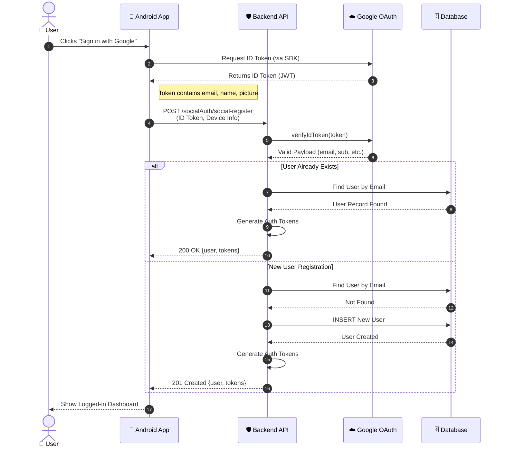

# 🌐 Google Sign-In with Credential Manager

This guide explains how **Google Sign-In** works in an Android app backed by a Node.js API.

> [!TIP]
> **Quick Summary**: The Android app gets an ID Token from Google, sends it to your Backend, and your Backend verifies it with Google before issuing its own session tokens.

---

## ⚡ Quick Implementation Checklist

- [ ] **Android**: Integrate Credential Manager API.
- [ ] **Android**: Obtain `ID Token` from Google.
- [ ] **Backend**: Create endpoint `POST /socialAuth/social-register`.
- [ ] **Backend**: Verify token using `google-auth-library`.
- [ ] **Backend**: Check if user exists (Login) or create new (Register).
- [ ] **Backend**: Return your own `accessToken` & `refreshToken`.

---

## 🖼️ Sequence Diagram (Mermaid)

This diagram visualizes the trust handshake between the Android app, your backend, Google’s servers, and your database.

---

## 🔍 Step-by-Step Explanation

### 1. User Action
The user taps the Google sign-in button. The Android app starts the OAuth flow using the **Credential Manager API**.

### 2. App Requests ID Token
Google handles the UI. After successful login, it returns an **ID Token** (a JWT) that proves identity.

### 3. App Sends Token to Backend
The app sends the ID token to your API:
`POST /socialAuth/social-register`

### 4. Backend Verifies Token
**Crucial Step**: Your backend must **NOT** trust the token blindly. It verifies it with Google to ensure:
*   Valid signature?
*   Not expired?
*   Issued for *your* Client ID?

### 5. Login or Registration Logic
*   **Existing User**: If the email exists in your DB, log them in.
*   **New User**: If not, create a new user record automatically (JIT Provisioning).

### 6. Issue App Tokens
Finally, your backend issues its **own** access/refresh tokens. The app uses these for future requests, not the Google token.