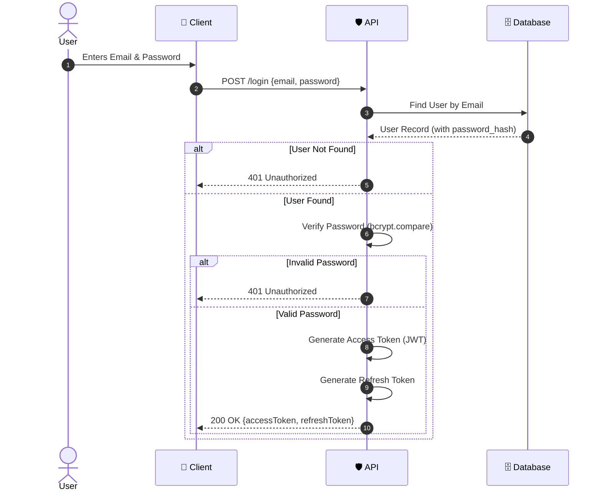

# 🔐 Authentication Master Guide

Welcome to the **Authentication Engineering** module. This guide serves as the central hub for mastering identity, security, and access control.

> [!NOTE]
> Authentication is the "who are you?" of security. It is distinct from Authorization ("what can you do?"), though they often go hand-in-hand.

---

## 📚 Table of Contents

- **[01. Engineering Roadmap](./01-authentication/00-index.md)**  
  A step-by-step path from "Foundations" to "Zero Trust Architecture".
- **[02. Social Login Deep Dive](./02-social-login/google-login.md)**  
  Detailed flows for integrating Google Sign-In and other providers.

---

## 🏗️ High-Level Architecture

This diagram illustrates where Authentication fits in a typical modern web application stack.

```mermaid
graph TD
    User((👤 User))
    Client[📱 Client App<br/>(Web/Mobile)]
    LB[⚖️ Load Balancer]
    AuthService[🛡️ Auth Service]
    AppService[⚙️ App Service]
    DB[(🗄️ Database)]
    Redis[(⚡ Redis Cache)]
    IdP[☁️ External IdP<br/>(Google/Auth0)]

    User -->|1. Login| Client
    Client -->|2. Credentials/Token| LB
    LB -->|3. Route| AuthService
    AuthService -->|4a. Validate| DB
    AuthService -->|4b. Check Session| Redis
    AuthService -.->|4c. Federate| IdP
    AuthService -->|5. Issue Token| Client
    Client -->|6. API Request + Token| AppService
    AppService -->|7. Verify Token| AuthService
```

---

## 🔑 Standard Login Flow (Email/Password)

Before diving into complex social logins, master the classic **Email & Password** flow.

### The Flow
1.  **User** submits email & password.
2.  **Server** retrieves the user record.
3.  **Server** compares the *hashed* password (using bcrypt/argon2) with the stored hash.
4.  **Server** generates a **JWT (JSON Web Token)** or creates a **Session**.
5.  **Server** returns the token/cookie to the client.

### Sequence Diagram



> [!IMPORTANT]
> **Never store passwords in plain text.** Always use a strong hashing algorithm like **Argon2id** or **Bcrypt**.

---

## 🛡️ Security Checklist for Production

- [ ] **HTTPS Everywhere**: Encrypt data in transit.
- [ ] **Secure Cookies**: Use `HttpOnly`, `Secure`, and `SameSite=Strict` flags.
- [ ] **Rate Limiting**: Prevent brute-force attacks on `/login`.
- [ ] **Input Validation**: Sanitize all inputs to prevent SQL Injection/XSS.
- [ ] **MFA**: Implement Multi-Factor Authentication for sensitive actions.
