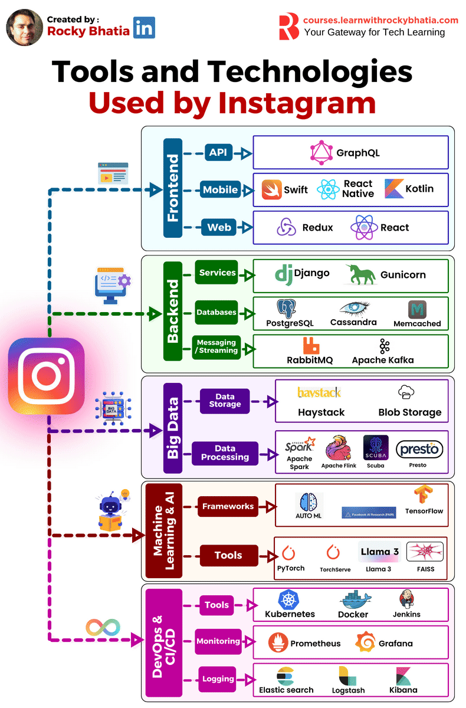

Great question 👍
You’ve shared an infographic showing **Tools and Technologies used by Instagram**, covering **Frontend, Backend, Big Data, Machine Learning/AI, and DevOps**. Let’s break it down in detail — what each tool does, how it is used, and when it fits into Instagram’s ecosystem (or any large-scale app).

---

## 🟦 Frontend (User Interface Layer)

1. **GraphQL**

   * **What**: A query language for APIs that allows clients to request only the data they need.
   * **Use**: Efficiently fetch data for Instagram’s feed, stories, and profiles without over-fetching or under-fetching.
   * **When**: Used instead of REST APIs for performance and flexibility.

2. **Swift**

   * **What**: Apple’s programming language for iOS development.
   * **Use**: Instagram’s iPhone app is written in Swift for speed and smooth UI.
   * **When**: Used when building iOS apps natively.

3. **React Native**

   * **What**: Cross-platform mobile framework built on React.
   * **Use**: Instagram uses it for certain screens/features that run on both iOS & Android with shared code.
   * **When**: Best for hybrid features that don’t need full native performance.

4. **Kotlin**

   * **What**: Official language for Android development.
   * **Use**: Instagram’s Android app uses Kotlin for concise, modern, and efficient code.
   * **When**: For Android-specific functionality.

5. **Redux**

   * **What**: State management library for JavaScript apps.
   * **Use**: Manages global UI states (e.g., feed loading, notifications).
   * **When**: Useful when multiple components need to share synchronized data.

6. **React**

   * **What**: JavaScript library for building UIs.
   * **Use**: Instagram’s web app frontend.
   * **When**: For scalable, component-based web development.

---

## 🟩 Backend (Core Services)

1. **Django**

   * **What**: High-level Python web framework.
   * **Use**: Instagram was originally built on Django; still powers many APIs.
   * **When**: Rapid development and robust backend services.

2. **Gunicorn**

   * **What**: Python WSGI HTTP server.
   * **Use**: Runs Django apps in production.
   * **When**: Needed to handle multiple requests efficiently.

3. **PostgreSQL**

   * **What**: Relational database (SQL).
   * **Use**: Stores structured Instagram data (users, posts, comments).
   * **When**: For ACID-compliant, relational data needs.

4. **Cassandra**

   * **What**: NoSQL distributed database.
   * **Use**: Stores large-scale, high-volume data (likes, follows, analytics).
   * **When**: Needed for high availability and scalability.

5. **Memcached**

   * **What**: In-memory key-value store.
   * **Use**: Caches frequently accessed data (feeds, sessions).
   * **When**: To reduce database load and speed up responses.

6. **RabbitMQ**

   * **What**: Message broker for queuing.
   * **Use**: Handles tasks asynchronously (notifications, emails).
   * **When**: For reliable background job processing.

7. **Apache Kafka**

   * **What**: Distributed event-streaming platform.
   * **Use**: Manages real-time data streams (user activity feeds, live video).
   * **When**: For scalable event-driven architectures.

---

## 🟪 Big Data (Storage & Processing)

1. **Haystack**

   * **What**: Distributed search system.
   * **Use**: Helps Instagram handle text/image/video search efficiently.
   * **When**: For indexing and searching billions of posts.

2. **Blob Storage**

   * **What**: Object storage for unstructured data.
   * **Use**: Stores media files (photos, videos, stories).
   * **When**: For large-scale content storage.

3. **Apache Spark**

   * **What**: Big data processing engine.
   * **Use**: For large-scale analytics, ML model training.
   * **When**: When batch processing massive datasets.

4. **Apache Flink**

   * **What**: Real-time stream processing framework.
   * **Use**: For real-time analytics (trending hashtags, live engagement).
   * **When**: For continuous data streams.

5. **Scuba**

   * **What**: Internal Facebook (Meta) real-time analysis tool.
   * **Use**: Used by Instagram engineers for internal data exploration.
   * **When**: For quick internal insights.

6. **Presto**

   * **What**: Distributed SQL query engine.
   * **Use**: Querying data across different storage systems (logs, databases).
   * **When**: For interactive analytics on big datasets.

---

## 🟥 Machine Learning & AI

1. **AutoML**

   * **What**: Automates ML model selection & training.
   * **Use**: Helps non-experts build ML models.
   * **When**: To accelerate ML experimentation.

2. **Facebook AI Research (FAIR)**

   * **What**: Meta’s AI research framework.
   * **Use**: Instagram leverages it for cutting-edge ML.
   * **When**: For advancing recommendation algorithms.

3. **TensorFlow**

   * **What**: Google’s ML framework.
   * **Use**: Used for image recognition, spam detection.
   * **When**: For training deep learning models.

4. **PyTorch**

   * **What**: ML framework from Meta.
   * **Use**: Instagram’s main ML library (recommendations, content ranking).
   * **When**: For flexible, production-ready ML.

5. **TorchServe**

   * **What**: Model serving tool for PyTorch.
   * **Use**: Deploys ML models at scale.
   * **When**: For production ML serving.

6. **LLaMA 3**

   * **What**: Meta’s large language model.
   * **Use**: Possibly for moderation, recommendations, and AI assistants.
   * **When**: For NLP tasks.

7. **FAISS**

   * **What**: Library for fast similarity search.
   * **Use**: Finds similar images, recommends content.
   * **When**: For nearest-neighbor searches in ML.

---

## 🟨 DevOps & CI/CD

1. **Kubernetes**

   * **What**: Container orchestration system.
   * **Use**: Runs Instagram’s services across clusters.
   * **When**: For scaling apps in production.

2. **Docker**

   * **What**: Containerization platform.
   * **Use**: Packages Instagram services into portable containers.
   * **When**: For consistent deployments.

3. **Jenkins**

   * **What**: CI/CD automation tool.
   * **Use**: Automates builds, testing, deployments.
   * **When**: For continuous integration.

4. **Prometheus**

   * **What**: Monitoring & alerting system.
   * **Use**: Tracks metrics like server health, latency.
   * **When**: For performance monitoring.

5. **Grafana**

   * **What**: Visualization dashboard.
   * **Use**: Displays metrics from Prometheus.
   * **When**: For dashboards and analytics.

6. **Elasticsearch**

   * **What**: Full-text search & analytics engine.
   * **Use**: For logs and search queries.
   * **When**: For indexing/searching massive data.

7. **Logstash**

   * **What**: Log processing pipeline.
   * **Use**: Collects and processes Instagram’s logs.
   * **When**: To prepare logs for analysis.

8. **Kibana**

   * **What**: Data visualization for Elasticsearch.
   * **Use**: Provides dashboards for log data.
   * **When**: For log monitoring & analysis.

---

✅ In summary:

* **Frontend** → Smooth user experience (React, GraphQL, Swift, Kotlin).
* **Backend** → Robust scalable systems (Django, PostgreSQL, Kafka).
* **Big Data** → Handles billions of media & interactions.
* **ML/AI** → Powers recommendations, moderation, personalization.
* **DevOps** → Ensures reliability, monitoring, and continuous delivery.

---

👉 Do you want me to also **map each tool to a real Instagram feature** (e.g., Stories, Explore, Reels) so it’s even more practical?

Perfect 👍 Let’s **map Instagram’s features** to the tools/technologies in the diagram. This will make it crystal clear how each piece fits into what you actually see in the Instagram app.

---

# 🟦 Frontend (User Experience Layer)

* **GraphQL** → Powers the **feed, profile, and Explore page** data fetching. Instead of loading too much or too little data, GraphQL fetches only what the screen needs.
* **Swift (iOS)** → Used in **iPhone app UI** like Stories carousel, Reels video player, DMs.
* **Kotlin (Android)** → Same as Swift but for **Android app** features like notifications, IGTV.
* **React Native** → Certain hybrid parts like **profile edit page or settings** for both iOS & Android.
* **React + Redux (Web)** → **Instagram web app** (explore feed, login, comments) uses React for UI and Redux to manage states like notifications, feed updates.

---

# 🟩 Backend (Core Engine)

* **Django + Gunicorn** → Core API services:

  * Uploading posts
  * Handling likes/comments
  * User authentication
* **PostgreSQL** → Structured data like:

  * Users, followers, comments, hashtags.
* **Cassandra** → High-volume, distributed data like:

  * Billions of likes & relationships (who follows whom).
* **Memcached** → Caches **user sessions and feed previews** for faster loading.
* **RabbitMQ** → Background jobs like:

  * Sending push notifications
  * Sending emails (password reset).
* **Apache Kafka** → Real-time streams like:

  * Live video chat
  * Real-time activity feed ("User X liked your photo").

---

# 🟪 Big Data (Analytics & Storage)

* **Haystack** → Search system for:

  * Searching usernames, hashtags, captions.
* **Blob Storage** → Stores **all photos, videos, reels, and stories**.
* **Apache Spark** → Batch analytics:

  * Which posts got the most likes today?
  * Which hashtags are trending?
* **Apache Flink** → Real-time analytics:

  * Showing trending reels **instantly**
  * Detecting spam accounts in real time.
* **Scuba (Meta internal tool)** → Used by Instagram engineers for internal analysis like:

  * "How many uploads failed in the last 10 minutes?"
* **Presto** → Ad-hoc querying:

  * "Show me engagement for Reels in Asia last week."

---

# 🟥 Machine Learning & AI (Smart Features)

* **AutoML** → Helps non-ML engineers quickly build models for experiments (e.g., A/B testing explore recommendations).
* **Facebook AI Research (FAIR)** → Research powering Instagram’s recommendation engine (e.g., **Reels ranking**).
* **TensorFlow** → Image recognition:

  * Detects nudity, violence, spam content.
* **PyTorch** → Recommendation system & personalization:

  * "Which reels should you see next?"
  * "Which ads are relevant to you?"
* **TorchServe** → Serves ML models in production for moderation, feed ranking.
* **LLaMA 3** → NLP models for:

  * **Content moderation (toxic comments)**
  * Auto-caption suggestions.
* **FAISS** → Finds similar media:

  * "Similar Reels"
  * "Suggested accounts to follow."

---

# 🟨 DevOps & CI/CD (Reliability & Scaling)

* **Kubernetes** → Runs Instagram services at scale across data centers.
* **Docker** → Containers for microservices (API, search, recommendations).
* **Jenkins** → Automates deployments (rolling out a new feature like **Reels Ads**).
* **Prometheus + Grafana** → Monitoring:

  * Detecting latency spikes when millions join a live stream.
* **Elasticsearch + Logstash + Kibana (ELK stack)** → Log monitoring:

  * Detecting bugs, login failures, suspicious activity.

---

✅ **Instagram Feature-to-Tech Mapping Summary**:

* **Stories, Reels, Feed** → React, Swift, Kotlin + Kafka (real-time) + PyTorch (ranking).
* **Explore page** → GraphQL + FAISS (similarity search) + Spark/Flink (trends).
* **Search (hashtags, users)** → Haystack + Elasticsearch.
* **Notifications (likes, comments, follows)** → RabbitMQ + Cassandra.
* **Content moderation** → TensorFlow + PyTorch + LLaMA 3.
* **Performance & scaling** → Kubernetes, Docker, Prometheus, ELK.

---

👉 Do you want me to also create a **visual feature-to-tool mapping chart** (like “Stories → Kafka + Cassandra + PyTorch”) for quick reference?

